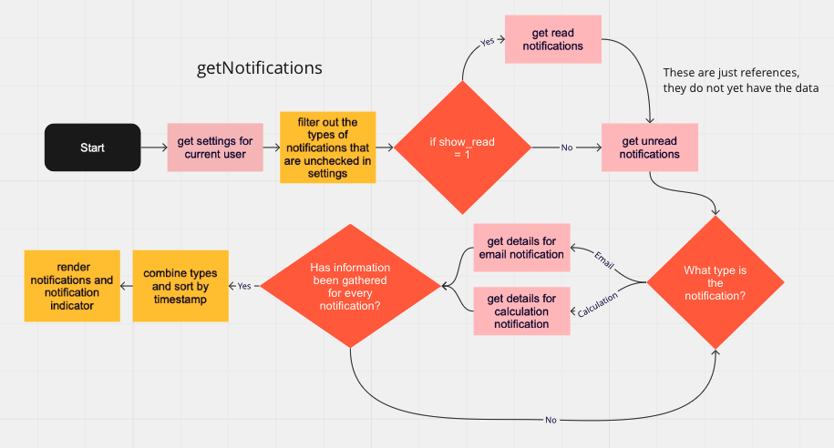

# Notifications for RedEye

## Overview

During my 2 week work experience at RedEye, I was given a project to build a notifications tray for one of their existing products that enables businesses to automate their marketing. For such a short project, I was not given access to the existing code so instead I asked questions about the system and built a proof of concept to demonstrate how the feature would work. For this reason, I did not build a shiny UI, just a POC as the notifications tray would be added to the existing UI. 

## Requirements

- Single Page
- Can make a notification for a variety of events (e.g. SMS, email, cleardown, calculation) all with different attributes
- Uses an SQL database and PHP and JS so that it can fit in with the current Contour tech stack. 

## My Approach

1) In the first few days, I prepared a development environment and began writing the requirements for the feature and planning a solution. By having a look at a few possibilities I was able to get feedback from experienced developers as to which path is recommended.  

2) I then started learning some PHP and set up a MySQL database. I set up tables to hold calculations and emails and then then a notifications table that stored a reference to the other tables and value for whether it had been read or not. I used JQuery AJAX requests to transfer information between the client and the server. I had to utilise callbacks so that all requests were carried out in a feasible order. The flow diagram below shows the logic behind the getNotifications function which is regularly called.

3) I received some feedback along the way such as being told to change my PHP syntax in order to protect against SQL injection. 

